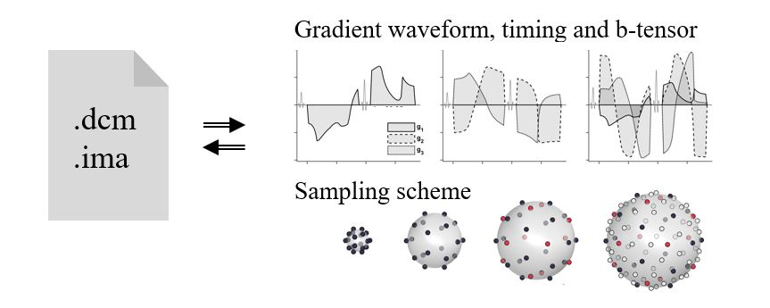

## Free Waveform header tools
Filip Szczepankiewicz and Isaiah Norton

Brigham and Women's Hospital, MA, Boston  
Harvard Medical School, MA, Boston

### Scope
The scope of this library is threefold:  
1. To provide a small abstraction to ENCODE blocks of typed vectors in base64. By doing so we can easily store the gradient waveform in the dicom header. This saves space and allows arbitrary data without risking any null characters. This set of funciton can be used in any C-based code.   
-See example in `vectest.c::create()`  
2. To provide tools that can DECODE the stored information. These are implemented primarily in MATLAB, but some instructions can be found also for PYTHON.  
-See examples in `fwf_decode_example_matlab.m` and `fwf_decode_example_python.py`  
3. To provide tools that can extract sequence configurations from specific implementations of the Free Waveform (FWF) sequence. Currently this is implemented at Siemens MRI systems with the free waveform (FWF) pulse sequence developed at Lund University, version 1.12 or later.  
-See example in `fwf_siemens_example.m`

### Reference
If you use the resources of this repository, please include a reference to:  
[F Szczepankiewicz, S Hoge, C-F Westin. Linear, planar and spherical tensor-valued diffusion MRI data by free waveform encoding in healthy brain, water, oil and liquid crystals. Data in Brief (2019), DOI: https://doi.org/10.1016/j.dib.2019.104208](https://doi.org/10.1016/j.dib.2019.104208)

### Example figure

The included tools can be used to encode and decode inforamtion specific to the free waveform sequence, such as the gradient waveform, sequence timing, actual b-tensors and sampling scheme.

### Related resources can be found at the [FWF sequence GIT repository](https://github.com/filip-szczepankiewicz/fwf_seq_resources)
